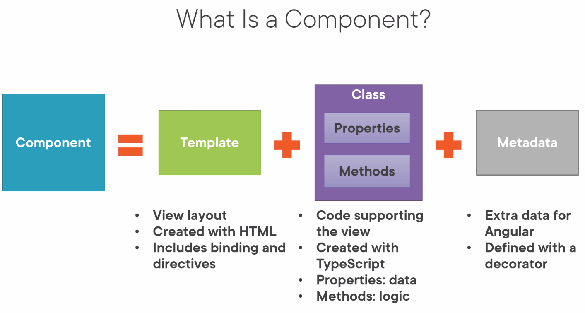
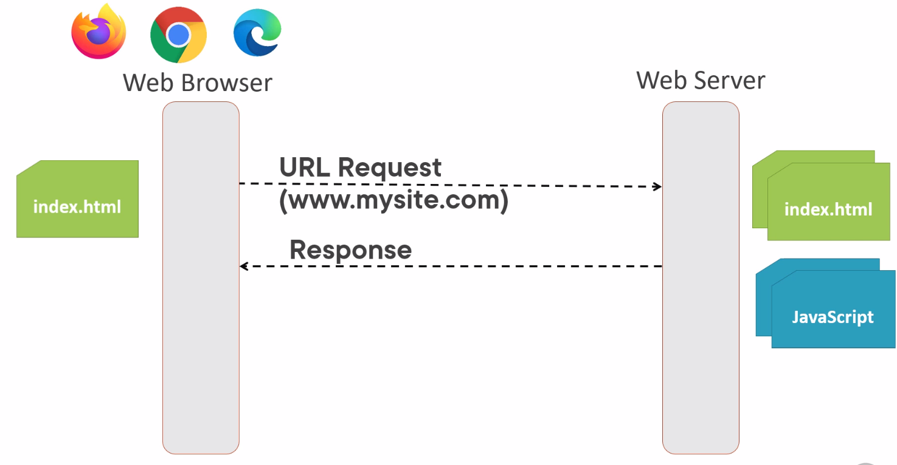
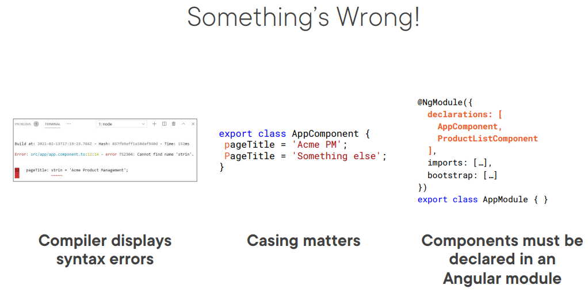
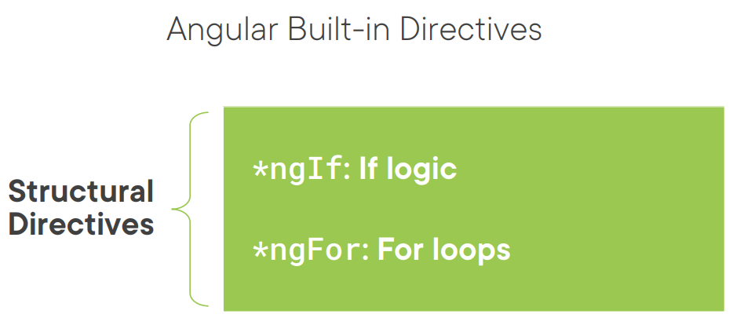
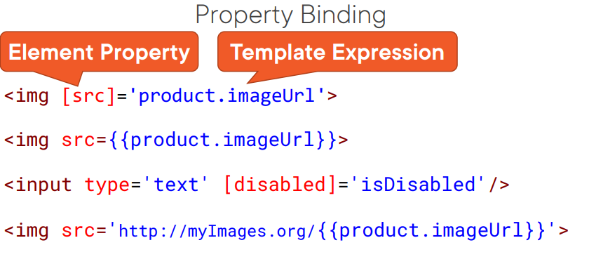
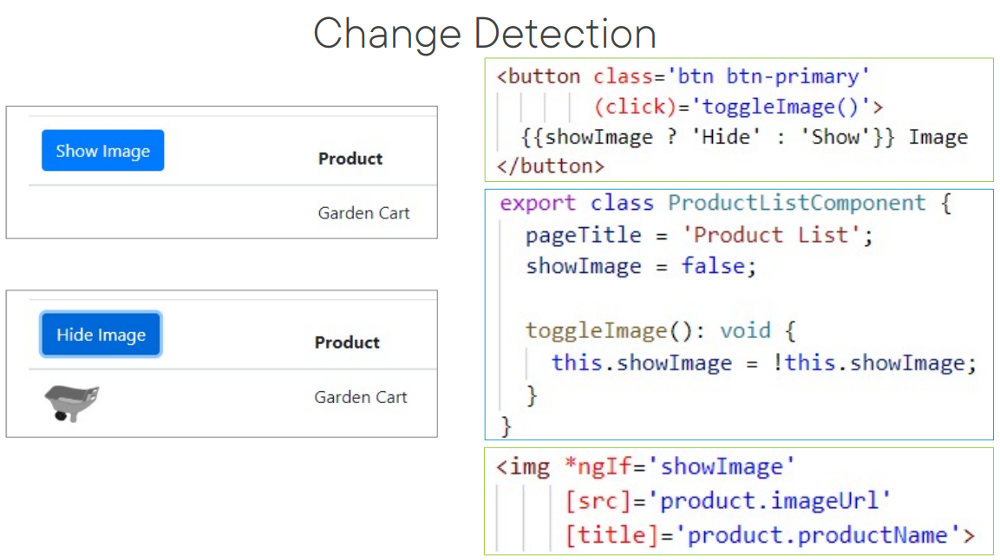
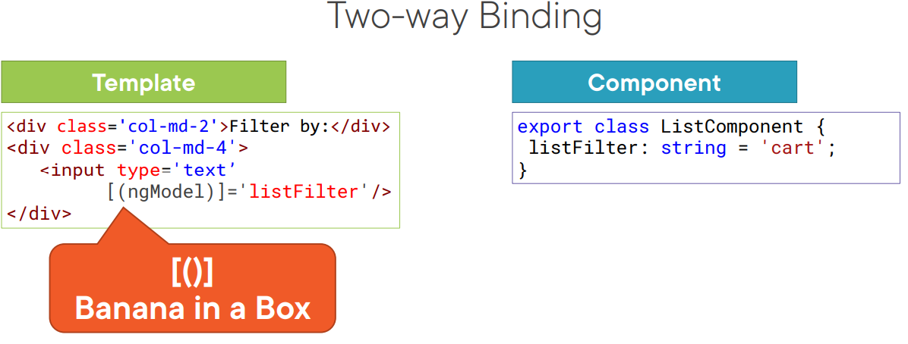
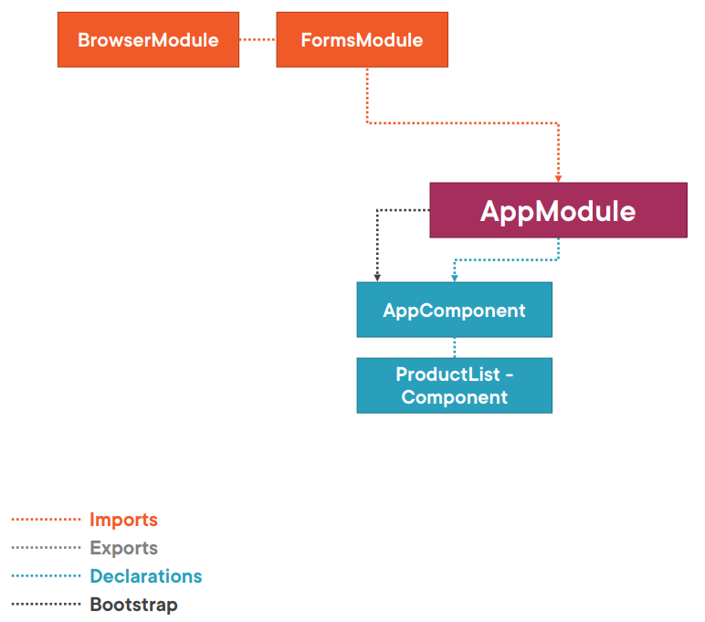
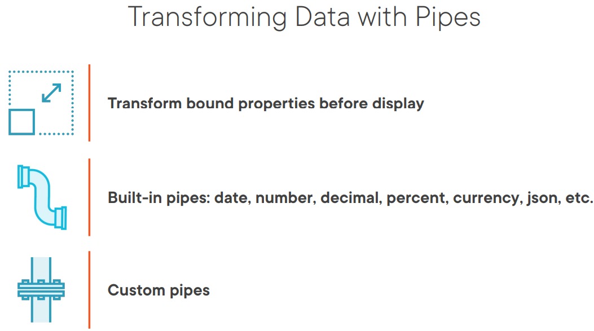
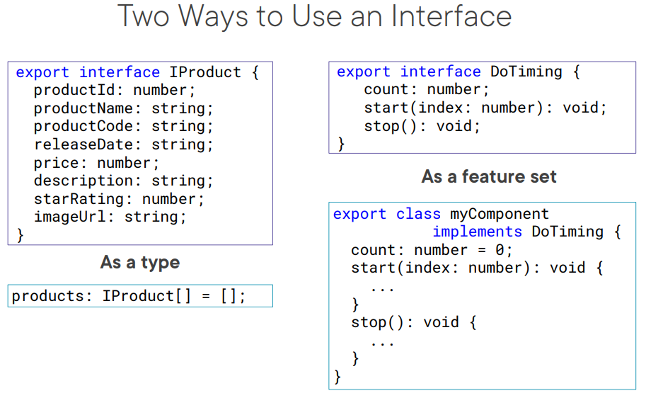

## Install the Angular CLI

install node js
install vs code + angular extention pack inside vs code (Extention tab)
install git

clone https://github.com/kikoosvk/Angular-GettingStarted

Go to package folder - APM-Start
open in vscode


package.json - list of packages

```
npm install
```

Start script in package.json
```
npm start
```

Cli builds the app, starts the webserver

http://localhost:4200/

Change the app.component file to see hot reload. (code recompiled, browser refreshed)

To stop the server: CTRL + C

Set Auto-save

ng serve - ng not recognized

install Angular cli globally

```
npm install -g @angular/cli
```

Create new angular project using the installed angular cli

```
ng new apm-new --prefix pm
```

# Component
add img





Check how component looks like: app.component.ts

DEMO
Change app.component.ts to

```
import { Component } from '@angular/core';

@Component({
  selector: 'pm-root',
  template: `
  <div><h1>{{pageTitle}}</h1>
      <div>My First Component</div>
  </div>
  `
})
export class AppComponent {
  pageTitle: string = 'Acme Product Management';
}

```


Bootstraping the app



index.html contains the main page for the application 
This is often the only Web page of the application 
Hence an Angular application is often called a Single Page Application (SPA)

Angular uses compiler to compile html templates and component to js 

In index.html we use component selector as a directive (pm-root) 
Browser have developer tools (elements, console, sources)





# Templates, Interpolation, and Directives

import boot-strap + font-awesome

```
@import "~bootstrap/dist/css/bootstrap.min.css";
@import "~font-awesome/css/font-awesome.min.css";
```

Create new folder in app products

create template for products (product-list.component.html)

First add card header
```
<div class='card'>
    <div class='card-header'>
      Product List
    </div>
</div>
```

then add filter 

```
    <div class='card-body'>
        <div class='row'>
          <div class='col-md-2'>Filter by:</div>
          <div class='col-md-4'>
            <input type='text' />
          </div>
        </div>
        <div class='row'>
          <div class='col-md-6'>
            <h4>Filtered by: </h4>
          </div>
        </div>
      </div>
```

then add table
```
    <div class='table-responsive'>
      <table class='table'>
        <thead>
          <tr>
            <th>
              <button class='btn btn-primary'>
                Show Image
              </button>
            </th>
            <th>Product</th>
            <th>Code</th>
            <th>Available</th>
            <th>Price</th>
            <th>5 Star Rating</th>
          </tr>
        </thead>
        <tbody>
        </tbody>
      </table>
    </div>
```

now we need to build the component class

Create product-list.component.ts file

```
import { Component } from '@angular/core';

@Component({
  selector: 'pm-products',
  templateUrl: './product-list.component.html'

})
export class ProductListComponent {
}
```

Add pm-products selector to app component

Add products component to app module declaration

#### Interpolation
create new pageTitle property in product list and use interpolation
```
  pageTitle: string = 'Product List';
```

check side by side that it work

#### Directives



Browser modules exports these directives which means we can use them

Add some mock products data
```
products: any[] = [
    {
      "productId": 2,
      "productName": "Garden Cart",
      "productCode": "GDN-0023",
      "releaseDate": "March 18, 2021",
      "description": "15 gallon capacity rolling garden cart",
      "price": 32.99,
      "starRating": 4.2,
      "imageUrl": "assets/images/garden_cart.png"
    },
    {
      "productId": 5,
      "productName": "Hammer",
      "productCode": "TBX-0048",
      "releaseDate": "May 21, 2021",
      "description": "Curved claw steel hammer",
      "price": 8.9,
      "starRating": 4.8,
      "imageUrl": "assets/images/hammer.png"
    }
  ];
```

use ngIf structural directive to hide to table if there are no products
```
*ngIf='products.length'
```

use ngFor to display the products in the table
```
<tr *ngFor='let product of products'>
            <td></td>
            <td>{{ product.productName }}</td>
            <td>{{ product.productCode }}</td>
            <td>{{ product.releaseDate }}</td>
            <td>{{ product.price }}</td>
            <td>{{ product.starRating }}</td>
          </tr>
```

# Data Binding & Pipes


Use Property binding to show images
```

```

Use property binding to make the images smaller

add property for width and margin
```
  imageWidth: number = 50;
  imageMargin: number = 2;
```

use them in the template
```
                   [style.width.px]='imageWidth'
                   [style.margin.px]='imageMargin'
```

So far we use one way binding from component class to template
no lets do it other way around from template to class component

Event binding
add property that tracks the button visibility

```
showImage: boolean = false;
```

add toggle image method that will be called when the button is clicked
```
  toggleImage(): void {
    this.showImage = !this.showImage;
  }
```

add click event binding to the button
```
(click)='toggleImage()'
```

use property binding to show/hide the images
```
*ngIf='showImage'
```

The button text does not change, we use interpolation to change it to display show or hide string, based on the introduced showImageproperty

```
{{showImage ? 'Hide' : 'Show'}} Image
```

### Change detection


### Two way binding




##### Add property for filter
```
listFilter: string = 'cart';
```

Add bannana

```
[(ngModel)]='listFilter'
```

Display filtered value in a h4 element using interpolation
```
Filtered by: {{listFilter}}
```

import Forms module


### Pipes



add pipes to product list table
```
{{ product.productCode | lowercase }}
```

transfrom currency 
```
{{ product.price | currency:'EUR':'symbol':'1.2-2'}}
```

# More on Components

##### Interface


Create new file product.ts
```
export interface IProduct {
  productId: number;
  productName: string;
  productCode: string;
  releaseDate: string;
  price: number;
  description: string;
  starRating: number;
  imageUrl: string;
}

```

##### External style sheet for component

these affects only the one component

create product-list.component.css in product list folder

add table header style inside the created style sheet

```
thead {
  color: #337AB7;
}
```

### Component Lifecycle


#### Lifecycle hooks


add  implements OnInit  interface and implement method 

```
 implements OnInit 
```

```
  ngOnInit(): void {
    console.log('ngOnInit')
  }
```


### Create custom pipe
create custom pipe that transforms any char to space to handle our product code

create convert-to-spaces.pipe.ts file in shared folder

```
import { Pipe, PipeTransform } from '@angular/core';

@Pipe({
  name: 'convertToSpaces'
})
export class ConvertToSpacesPipe implements PipeTransform {

  transform(value: string, character: string): string {
    return value.replace(character, ' ');
  }
}

```
add created pipe to appModule declaration array

### Getter and Setters


convert listFilter property to getter and setter variable

make the variable private and use underscore convention
```
  private _listFilter: string = '';
```

create a getter method with a keyword get
```
  get listFilter(): string {
    return this._listFilter;
  }
```

create a setter method with a keyword set
setter is executer every time a value is assigned to a variable
```
  set listFilter(value: string) {
    this._listFilter = value;
    console.log('In setter:', value);
  }
```

use ngOnInit to set a default value for a filter list 
```
this.listFilter = 'cart';
```

#### Filter products based on a listFilter property

create new property
```
  filteredProducts: IProduct[] = [];
```

set fltered products in listFilter setter
```
this.filteredProducts = this.performFilter(value);
```

create perform filter method that returns filtered products
```
 performFilter(filterBy: string): IProduct[] {
    filterBy = filterBy.toLocaleLowerCase();
    return this.products.filter((product: IProduct) =>
      product.productName.toLocaleLowerCase().includes(filterBy));
  }
```

# Building Nested Components


#### Replace product rating with nested start component

create star component class file star.component.ts in shader folder

```
import { Component, OnChanges } from "@angular/core";

@Component({
  selector: 'pm-star',
  templateUrl: './star.component.html',
  styleUrls: ['./star.component.css']
})
export class StarComponent implements OnChanges {
  rating: number = 4;
  cropWidth: number = 75;

  ngOnChanges(): void {
    this.cropWidth = this.rating * 75 / 5;
  }
}

```

add the star component directive to the product-list template and replace the number ratings with it

```
<td><pm-star></pm-star></td>
```

we see 5 start, coz the lifecycle on changes method is not trigger, it only watches the input properties

##### Input


add Input decorated to rating property
```
@Input() rating: number = 0;
```

bind product starRating to rating Input property of star component

```
<td><pm-star [rating]="product.starRating"></pm-star></td>
```